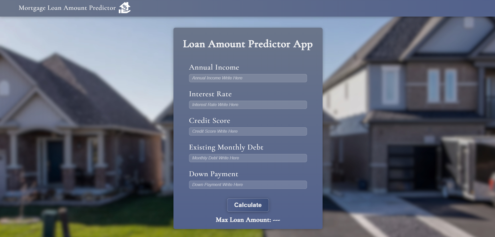

# Mortgage-Loan-Amount-Prediction
Predicting the maximum mortgage loan amount a bank can offer to an applicant based on demographic and financial features using machine learning regression models.



---

## Problem Statement

A bank wants to automate the process of determining the maximum mortgage loan amount for a new applicant. The model predicts the loan amount based on 5 key financial features.

---

## Features Used

| Feature | Description |
|---|---|
| Annual Income | Applicant's yearly income in USD |
| Interest Rate | Loan interest rate (e.g. 0.05 = 5%) |
| Credit Score | Applicant's credit score (580–850) |
| Existing Monthly Debt | Current monthly debt payments in USD |
| Down Payment | Initial payment amount in USD |

---

## Model Performance

| Metric | Value |
|---|---|
| Algorithm | Linear Regression |
| R² Score | 0.9502 |
| MAE | $51,858 |
| RMSE | $69,240 |

---

## Project Structure

```
Mortgage-Loan-Amount-Prediction/
├── Machine-Learning/
│   ├── data/
│   │   ├── raw.csv <-- (First uploaded dataset)
│   │   └── processed.csv <-- (Fully prepared dataset)
│   ├── models/
│   │   └── model.pkl <-- (Trained model)
│   └── notebook.ipynb
├── Api/
│   └── app.py <-- (API main file)
├── web/
│   └── app/
│       ├── app/ <-- (django project app)
│       ├── main/ <-- (main app)
│       └── manage.py 
└── README.md
```

---

## Tech Stack

- **ML:** Python, Pandas, Scikit-learn
- **Api:** FastAPI
- **Web:** Django, HTML, CSS

---

## Getting Started

### 1. Clone the repository
```bash
git clone https://github.com/Chumus2/Mortgage-Loan-Amount-Prediction-Regression.git
cd Mortgage-Loan-Amount-Prediction-Regression
```

### 2. Run the Docker
```bash
docker-compose up --build
```

### 3. Open in browser
- **Web App:** http://localhost:8001 or http://127.0.0.1:8001
- **API Docs:** http://localhost:8000/docs

---

## API Documentation

FastAPI auto-generates interactive docs:<br>
http://127.0.0.1:8000/docs

---

## How to Use

1. Open http://localhost:8001 or http://127.0.0.1:8001 in your browser
2. Fill in your financial details:
    - **Annual Income** — your yearly income in USD
    - **Interest Rate** — loan rate as decimal (e.g. `0.05` for 5%)
    - **Credit Score** — your credit score (580–850)
    - **Existing Monthly Debt** — current monthly debt in USD
    - **Down Payment** — initial payment amount in USD
3. Click **Calculate**
4. Get your predicted maximum loan amount 
